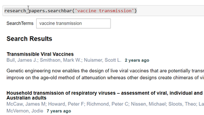

# COVID 19 Open Research Data Challenge Code
This repo contains code and notebooks for the [COVID-19 Open Research Dataset Challenge (CORD-19)](https://www.kaggle.com/allen-institute-for-ai/CORD-19-research-challenge)
on kaggle

## Installing

```{bash}
pip install git+https://github.com/dgunning/cord19.git
```

## Usage

```{python}
from cord import ResearchPapers

#data_dir = 'data'
data_dir = '..\input'

research_papers = ResearchPapers.load()
```

### Search Bar
```{python}
research_papers.searchbar('vaccine transmission')
```

